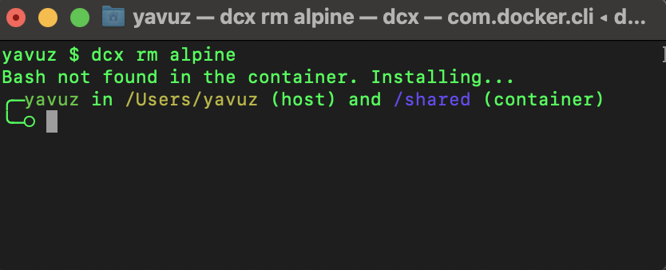

Single command docker executor, for spinning a bash terminal in seconds. 



## Features
Quick container instantiation with Docker
Auto-installation of Bash in the container if not present
Shared volume between the host and the container
Neatly formatted prompt to differentiate between the host and container environments
Optional container clean-up post session
Prerequisites
Docker must be installed and running on the machine.

## Usage
1. Running the tool:

```bash
dcx [options] [image-name]
```
2. Default Image:
By default, if no image is provided, alpine is used.

3. Use 'rm' Flag for Cleanup:
If you provide the rm flag, the container will be removed after you exit the Bash session.

```bash
dcx rm [image-name]
```

